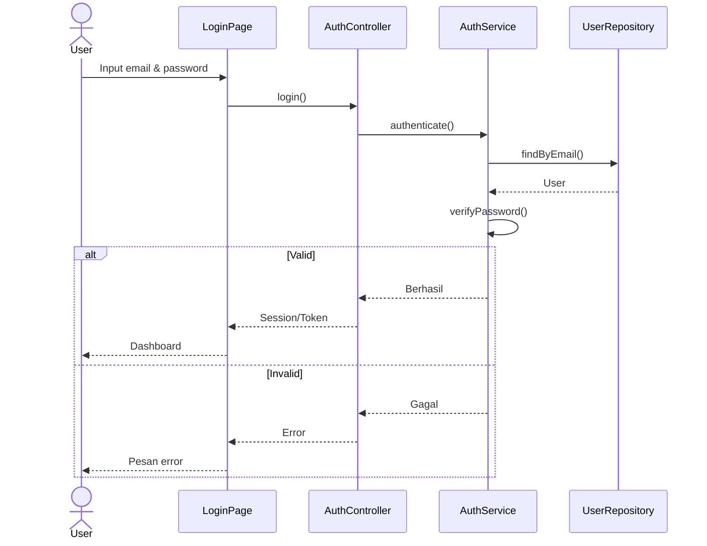
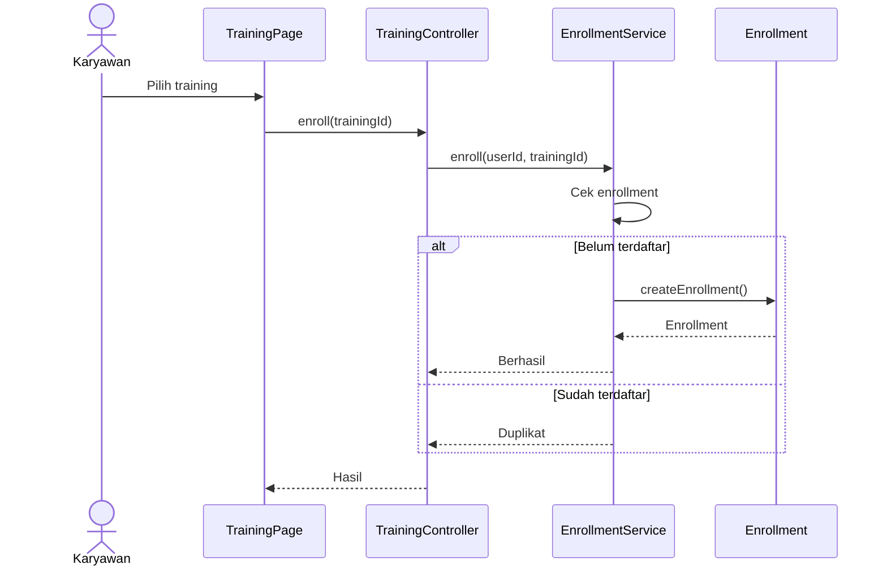
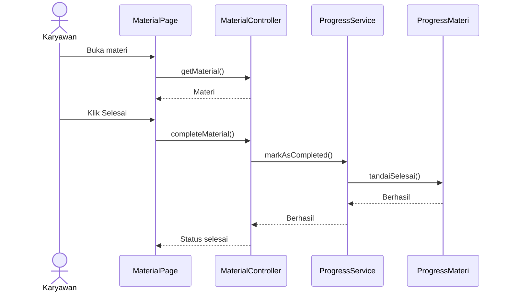
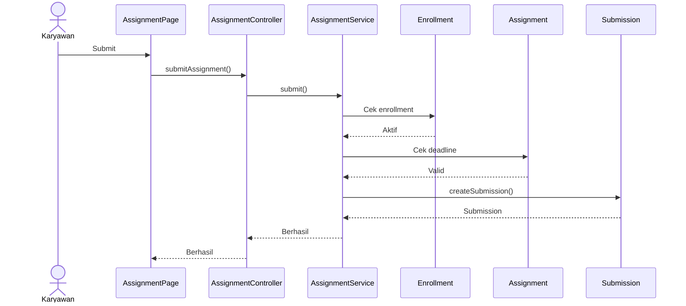
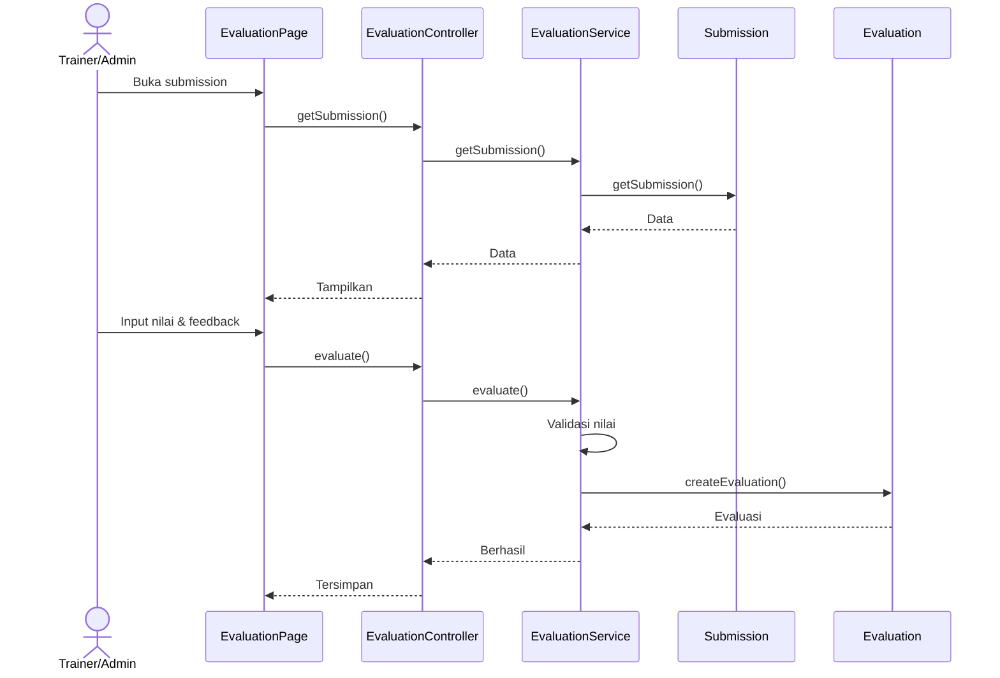
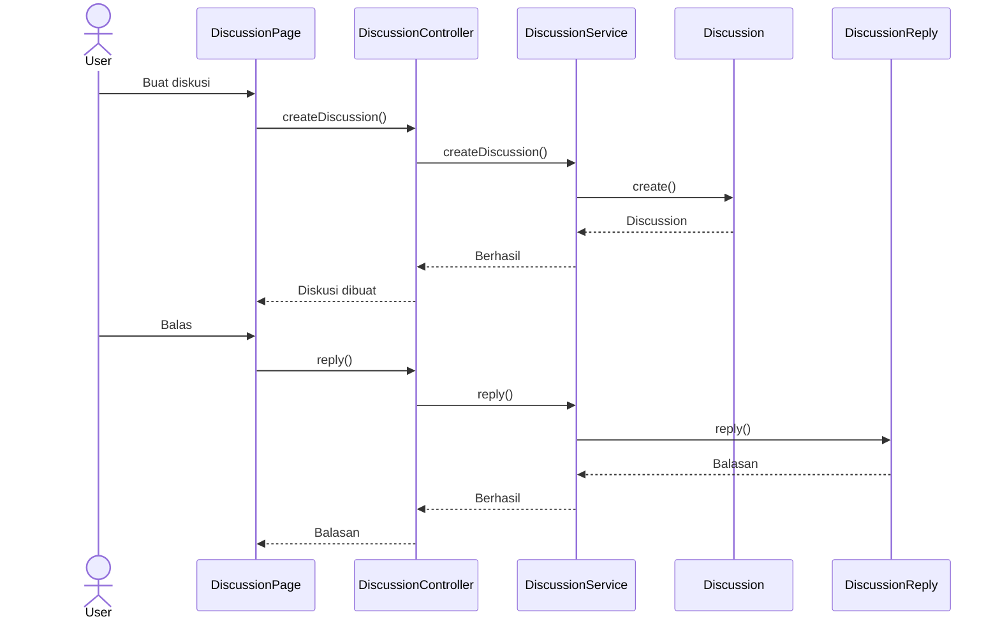
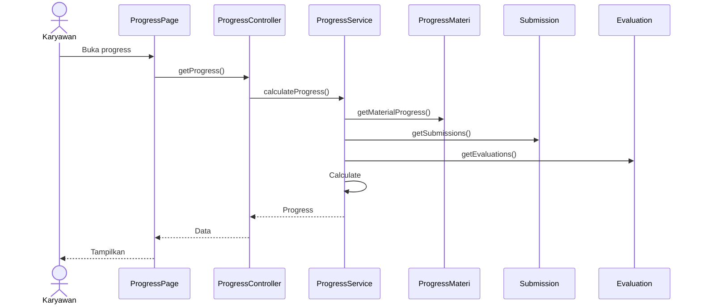

# TrainHub — Sequence Diagrams

## Login

```mermaid
sequenceDiagram
actor U as User
participant LP as LoginPage
participant AC as AuthController
participant AS as AuthService
participant UR as UserRepository
U->>LP: Input email & password
LP->>AC: login()
AC->>AS: authenticate()
AS->>UR: findByEmail()
UR-->>AS: User
AS->>AS: verifyPassword()
alt Valid
 AS-->>AC: Berhasil
 AC-->>LP: Session/Token
 LP-->>U: Dashboard
else Invalid
 AS-->>AC: Gagal
 AC-->>LP: Error
 LP-->>U: Pesan error
end
```

## Enrollment

```mermaid
sequenceDiagram
actor K as Karyawan
participant TP as TrainingPage
participant TC as TrainingController
participant ES as EnrollmentService
participant E as Enrollment
K->>TP: Pilih training
TP->>TC: enroll(trainingId)
TC->>ES: enroll(userId, trainingId)
ES->>ES: Cek enrollment
alt Belum terdaftar
 ES->>E: createEnrollment()
 E-->>ES: Enrollment
 ES-->>TC: Berhasil
else Sudah terdaftar
 ES-->>TC: Duplikat
end
TC-->>TP: Hasil
```

## Menyelesaikan Materi

```mermaid
sequenceDiagram
actor K as Karyawan
participant MP as MaterialPage
participant MC as MaterialController
participant PS as ProgressService
participant PM as ProgressMateri
K->>MP: Buka materi
MP->>MC: getMaterial()
MC-->>MP: Materi
K->>MP: Klik Selesai
MP->>MC: completeMaterial()
MC->>PS: markAsCompleted()
PS->>PM: tandaiSelesai()
PM-->>PS: Berhasil
PS-->>MC: Berhasil
MC-->>MP: Status selesai
```

## Submission

```mermaid
sequenceDiagram
actor K as Karyawan
participant AP as AssignmentPage
participant AC as AssignmentController
participant AS as AssignmentService
participant E as Enrollment
participant T as Assignment
participant S as Submission
K->>AP: Submit
AP->>AC: submitAssignment()
AC->>AS: submit()
AS->>E: Cek enrollment
E-->>AS: Aktif
AS->>T: Cek deadline
T-->>AS: Valid
AS->>S: createSubmission()
S-->>AS: Submission
AS-->>AC: Berhasil
AC-->>AP: Berhasil
```

## Evaluasi

```mermaid
sequenceDiagram
actor TA as Trainer/Admin
participant EP as EvaluationPage
participant EC as EvaluationController
participant ES as EvaluationService
participant S as Submission
participant E as Evaluation
TA->>EP: Buka submission
EP->>EC: getSubmission()
EC->>ES: getSubmission()
ES->>S: getSubmission()
S-->>ES: Data
ES-->>EC: Data
EC-->>EP: Tampilkan
TA->>EP: Input nilai & feedback
EP->>EC: evaluate()
EC->>ES: evaluate()
ES->>ES: Validasi nilai
ES->>E: createEvaluation()
E-->>ES: Evaluasi
ES-->>EC: Berhasil
EC-->>EP: Tersimpan
```

## Diskusi

```mermaid
sequenceDiagram
actor U as User
participant DP as DiscussionPage
participant DC as DiscussionController
participant DS as DiscussionService
participant D as Discussion
participant B as DiscussionReply
U->>DP: Buat diskusi
DP->>DC: createDiscussion()
DC->>DS: createDiscussion()
DS->>D: create()
D-->>DS: Discussion
DS-->>DC: Berhasil
DC-->>DP: Diskusi dibuat
U->>DP: Balas
DP->>DC: reply()
DC->>DS: reply()
DS->>B: reply()
B-->>DS: Balasan
DS-->>DC: Berhasil
DC-->>DP: Balasan
```

## Progress

```mermaid
sequenceDiagram
actor K as Karyawan
participant PP as ProgressPage
participant PC as ProgressController
participant PS as ProgressService
participant PM as ProgressMateri
participant S as Submission
participant EV as Evaluation
K->>PP: Buka progress
PP->>PC: getProgress()
PC->>PS: calculateProgress()
PS->>PM: getMaterialProgress()
PS->>S: getSubmissions()
PS->>EV: getEvaluations()
PS->>PS: Calculate
PS-->>PC: Progress
PC-->>PP: Data
PP-->>K: Tampilkan
```
